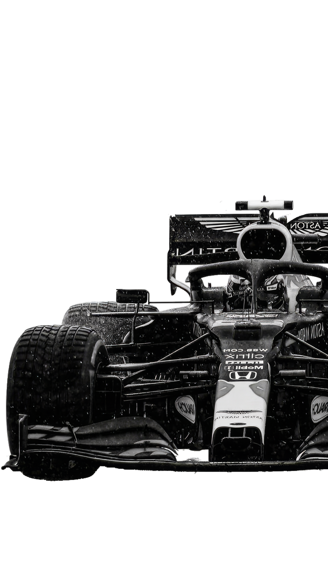

<!-- 

  
  <h1>
     Hi, I'm <a href="https://github.com/Asuna647" style="text-decoration: none;">Sarthak!</a>
  </h1>
  

  
  &nbsp;
  
  &nbsp; -->
  <!-- &nbsp; -->
  <!-- &nbsp; -->
  <!--  -->
  <!-- &nbsp; -->
  <!-- 
 -->
<!-- 
 -->

  <picture>
    <source media="(prefers-color-scheme: dark)"
      srcset="https://capsule-render.vercel.app/api?type=rect&height=2&color=F59E0B" />
    <source media="(prefers-color-scheme: light)"
      srcset="https://capsule-render.vercel.app/api?type=rect&height=2&color=D97706" />
    
  </picture>

   

  <picture>
    <source media="(prefers-color-scheme: dark)"
      srcset="https://readme-typing-svg.demolab.com?font=JetBrains+Mono&weight=600&size=40&duration=3000&pause=900&color=F8FAFC&center=true&vCenter=true&width=700&lines=Sarthak+Rai;Computer+Science+%26+AI+Student" />
    <source media="(prefers-color-scheme: light)"
      srcset="https://readme-typing-svg.demolab.com?font=JetBrains+Mono&weight=600&size=40&duration=3000&pause=900&color=171717&center=true&vCenter=true&width=700&lines=Sarthak+Rai;Computer+Science+%26+AI+Student" />
    
  </picture>

   

  <picture>
    <source media="(prefers-color-scheme: dark)"
      srcset="https://readme-typing-svg.demolab.com?font=JetBrains+Mono&weight=500&size=15&duration=2500&pause=1000&color=9CA3AF&center=true&vCenter=true&width=720&lines=Learning+DSA+in+Python+and+C;Exploring+computer+science+and+AI;Next+stop%3A+system+design" />
    <source media="(prefers-color-scheme: light)"
      srcset="https://readme-typing-svg.demolab.com?font=JetBrains+Mono&weight=500&size=15&duration=2500&pause=1000&color=4B5563&center=true&vCenter=true&width=720&lines=Learning+DSA+in+Python+and+C;Exploring+computer+science+and+AI;Next+stop%3A+system+design" />
    
  </picture>

<!-- 
 -->
  <!-- ═══ SOCIAL BADGES ══════════════════════════════════════════ -->
  
  <!-- 
 -->
<!-- 
 -->

<!-- 

  ### About me

  

  | 
🎓 <a href="https://www.abesit.in/" style="text-decoration: none;">GUB</a> • 2nd year CSAI Student 
  |
  | --------------------------------------------------------- |                             |
  | 🏫 Delhi, Delhi                                      |                                                 |
  | 🦀 **Currently building:** Mockproctor.                    |
  | 💙 **Love to:** Sleep                    |
  | 🌐 **Languages:** ENG 。HINDI                         |

---

  -->

    
  
   
  
  

 

---

<h2 align="center"> Languages-Frameworks-Tools </h2>
 

<table align="center">
  <tr>
    <td align="center" width="96">
         
    </td>
    <td align="center" width="96">
         
    </td>
    <td align="center" width="96">
         
    </td>
    <td align="center" width="96">
         
    </td>
    <td align="center" width="96">
        
    </td>
    <td align="center"  width="96">
        
    </td>
    <td align="center" width="96">
        
    </td>
  </tr>

  <tr>
    <td align="center" width="96">
        
    </td>
    <td align="center" width="96">
        
    </td>
    <td align="center" width="96">
        
    </td>
    <td align="center" width="96">
        
    </td>
    <td align="center" width="96">
        
    </td>
    <td align="center" width="96">
        
    </td>
    <td align="center"  width="96">
        
    </td>
  </tr>

  <tr>
    <td align="center" width="96">
        
    </td>
    <td align="center" width="96">
        
    </td>
    <td align="center" width="96">
        
    </td>
    <td align="center" width="96">
        
    </td>
    <td align="center" width="96">
        
    </td>
    <td align="center" width="96">
        
    </td>
    <td align="center" width="96">
        
    </td>
  </tr>
  <tr>
    <td align="center" width="96">
        
    </td>
    <td align="center" width="96">
        
    </td>
    <td align="center" width="96">
        
    </td>
    <td align="center" width="96">
        
    </td>
    <td align="center" width="96">
        
    </td>
    <td align="center" width="96">
        
    </td>
  </tr>
</table>

 

---

  <h2>💻 Competitive Programming</h2>

  

    

  Practising problem solving, DSA in Python and C, and building strong fundamentals.

Profile maintained by <a href="https://github.com/Asuna647">Sarthak Rai</a>.

